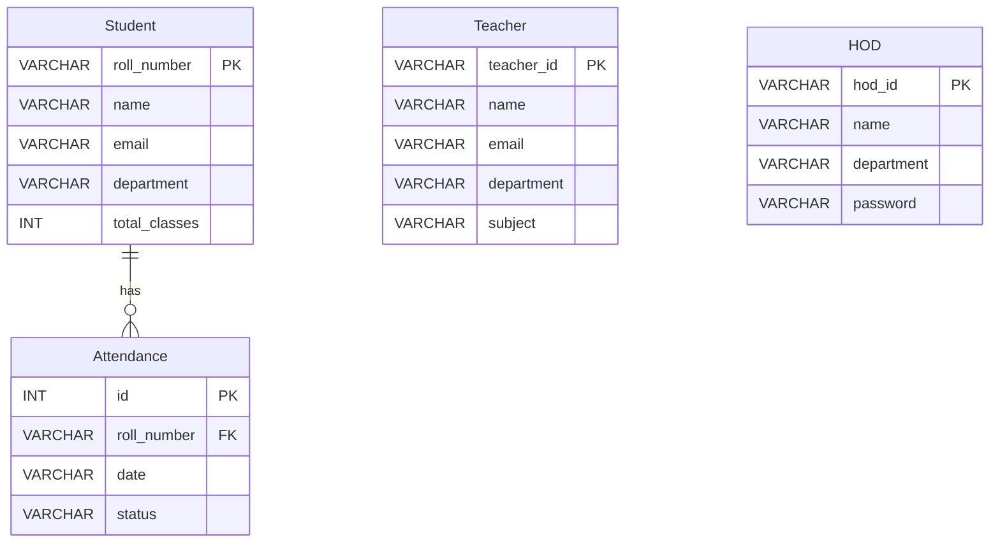

<p align="center">
  
  
  
  
  
</p>

<h1 align="center">
  📋 Attendify
</h1>

<p align="center">
  <b>Unified Student Attendance Management System</b>
</p>

<p align="center">
  <i>A comprehensive console-based attendance management application with role-based access control, built with Java and MySQL.</i>
</p>

<p align="center">
  <a href="#-features">Features</a> •
  <a href="#-tech-stack">Tech Stack</a> •
  <a href="#️-architecture">Architecture</a> •
  <a href="#-database-schema">Database</a> •
  <a href="#-getting-started">Getting Started</a> •
  <a href="#-usage">Usage</a> •
  <a href="#-troubleshooting">Troubleshooting</a>
</p>

---

## 📖 About

**Attendify** is a production-ready, console-based Student Attendance Management System that consolidates three role-specific portals — **HOD**, **Teacher**, and **Student** — into a single, unified application. It features a branded ANSI-colored terminal interface, persistent MySQL storage, and pre-loaded sample data for immediate demonstration.

> 💡 The application **automatically creates** the database, tables, default HOD, and sample data on the first run. No manual SQL setup is required.

---

## ✨ Features

### 🏛️ HOD Portal (Head of Department)
| Feature | Description |
|---------|-------------|
| 📊 **Department Report** | View attendance statistics across the entire department |
| 👨‍🏫 **Teacher Management** | List all registered teachers with their subjects |
| 👨‍🎓 **Student Overview** | Browse all students with department-wise filtering |
| ⚠️ **Low Attendance Alerts** | Identify students below the attendance threshold |
| 📈 **Overall Statistics** | Department-wide analytics with present/absent ratios |

### 👨‍🏫 Teacher Portal
| Feature | Description |
|---------|-------------|
| ➕ **Add Student** | Register new students with roll number, name, email, and department |
| 📝 **Mark Attendance** | Record daily attendance (Present/Absent) for individual students |
| 📋 **View All Students** | Display a formatted table of all registered students |
| 🔍 **Search Student** | Look up students by roll number |
| ✏️ **Update Student** | Modify student information |
| ❌ **Delete Student** | Remove students from the system |
| 📊 **Attendance Summary** | View attendance percentages for all students |

### 👨‍🎓 Student Portal
| Feature | Description |
|---------|-------------|
| 👤 **View Profile** | Display personal information (name, email, department) |
| 📅 **Attendance Records** | View day-by-day attendance history |
| 📊 **Attendance Percentage** | See overall attendance with a visual progress bar |

### 🔐 System Features
| Feature | Description |
|---------|-------------|
| 🔑 **Unified Login** | Single entry point with role-based routing |
| 🎨 **ANSI Colors** | Rich, color-coded console interface |
| 🖥️ **Windows Compatible** | ASCII-safe borders, automatic ANSI enablement |
| 💾 **Auto Database Setup** | Schema + sample data created on first launch |
| 🛡️ **Input Validation** | Robust error handling and input sanitization |

---

## 🛠️ Tech Stack

| Component | Technology |
|-----------|-----------|
| **Language** |  |
| **Database** |  |
| **JDBC Driver** |  |
| **Build** |  |
| **Platform** |    |

---

## 🏗️ Architecture

```
┌──────────────────────────────────────────────────────┐
│                     Main.java                        │
│              (Entry Point + Login Flow)              │
├──────────────┬──────────────────┬─────────────────────┤
│  HodPortal   │  TeacherPortal   │  StudentPortal      │
│  (Analytics) │  (CRUD + Attend) │  (Read-Only View)   │
├──────────────┴──────────────────┴─────────────────────┤
│                   DAO Layer                           │
│   HodDAO.java  │  StudentDAO.java  │  AttendanceDAO   │
├───────────────────────────────────────────────────────┤
│              DatabaseConnection.java                  │
│     (Singleton Connection + Schema Initialization)    │
├───────────────────────────────────────────────────────┤
│                 MySQL Database                        │
│    Student  │  Teacher  │  HOD  │  Attendance          │
└───────────────────────────────────────────────────────┘
```

### 📁 Project Structure

```
Attendify/
│
├── 📂 src/                          # Source code
│   ├── Main.java                    # Entry point, login flow, UI screens
│   ├── DatabaseConnection.java      # MySQL connection, schema init, sample data
│   │
│   ├── 📦 Models
│   │   ├── Student.java             # Student entity (POJO)
│   │   ├── Teacher.java             # Teacher entity (POJO)
│   │   └── HOD.java                 # HOD entity (POJO)
│   │
│   ├── 📦 DAOs (Data Access Objects)
│   │   ├── StudentDAO.java          # Student CRUD operations
│   │   ├── AttendanceDAO.java       # Attendance record operations
│   │   └── HodDAO.java             # HOD analytics & department queries
│   │
│   └── 📦 Portals (UI Controllers)
│       ├── HodPortal.java           # HOD dashboard & analytics
│       ├── TeacherPortal.java       # Teacher CRUD & attendance marking
│       └── StudentPortal.java       # Student profile & attendance view
│
├── 📂 lib/                          # Dependencies
│   └── mysql-connector-j-8.3.0.jar  # MySQL JDBC Driver
│
├── 📂 out/                          # Compiled .class files (auto-generated)
├── 📂 docs/                         # Documentation
└── 📄 README.md                     # This file
```

---

## 💾 Database Schema

The application uses **4 MySQL tables** in the `attendify` database:

### `Student`
| Column | Type | Constraint |
|--------|------|-----------|
| `roll_number` | `VARCHAR(50)` | `PRIMARY KEY` |
| `name` | `VARCHAR(100)` | `NOT NULL` |
| `email` | `VARCHAR(100)` | — |
| `department` | `VARCHAR(50)` | — |
| `total_classes` | `INT` | `DEFAULT 0` |

### `Teacher`
| Column | Type | Constraint |
|--------|------|-----------|
| `teacher_id` | `VARCHAR(50)` | `PRIMARY KEY` |
| `name` | `VARCHAR(100)` | `NOT NULL` |
| `email` | `VARCHAR(100)` | — |
| `department` | `VARCHAR(50)` | — |
| `subject` | `VARCHAR(100)` | — |

### `HOD`
| Column | Type | Constraint |
|--------|------|-----------|
| `hod_id` | `VARCHAR(50)` | `PRIMARY KEY` |
| `name` | `VARCHAR(100)` | `NOT NULL` |
| `department` | `VARCHAR(50)` | — |
| `password` | `VARCHAR(100)` | `DEFAULT '1234'` |

### `Attendance`
| Column | Type | Constraint |
|--------|------|-----------|
| `id` | `INT` | `PRIMARY KEY, AUTO_INCREMENT` |
| `roll_number` | `VARCHAR(50)` | `FOREIGN KEY → Student` |
| `date` | `VARCHAR(20)` | `NOT NULL` |
| `status` | `VARCHAR(10)` | `NOT NULL` (P/A) |

> 🔗 **Relationships:** `Attendance.roll_number` → `Student.roll_number` (Foreign Key)
> 🔒 **Unique Constraint:** `(roll_number, date)` — one record per student per day



---

## 📊 Pre-loaded Sample Data

The application comes with **sample data** that is automatically inserted on startup:

### 👨‍🏫 Teachers (5)
| ID | Name | Department | Subject |
|----|------|-----------|---------|
| T001 | Prof. Aarav Sharma | Computer Science | Data Structures |
| T002 | Prof. Sneha Patel | Computer Science | Operating Systems |
| T003 | Prof. Rajesh Kumar | Electronics | Digital Circuits |
| T004 | Prof. Priya Menon | Mechanical | Thermodynamics |
| T005 | Prof. Vikram Singh | Computer Science | Database Systems |

### 👨‍🎓 Students (10)
| Roll No. | Name | Department | Total Classes |
|----------|------|-----------|---------------|
| 001 | Aarav Mehta | Computer Science | 30 |
| 002 | Diya Sharma | Computer Science | 30 |
| 003 | Rohan Gupta | Computer Science | 30 |
| 004 | Ananya Iyer | Electronics | 28 |
| 005 | Kabir Patel | Electronics | 28 |
| 006 | Ishita Reddy | Mechanical | 25 |
| 007 | Arjun Nair | Computer Science | 30 |
| 008 | Meera Joshi | Computer Science | 30 |
| 009 | Siddharth Das | Electronics | 28 |
| 010 | Kavya Pillai | Mechanical | 25 |

### 📅 Attendance Records (100)
- **10 days** of attendance records per student (Feb 3–12, 2026)
- Varied patterns: 60% → 100% attendance
- Students 002 & 008 have perfect attendance (100%)
- Students 003, 005 & 009 have low attendance (60%)

### 🏛️ HOD (1)
| ID | Name | Department |
|----|------|-----------|
| HOD001 | Dr. Admin | Computer Science |

---

## 🚀 Getting Started

### Prerequisites

| Requirement | Version | Purpose |
|-------------|---------|---------|
| ☕ **JDK** | 21+ | Compile and run Java source |
| 🐬 **MySQL Server** | 8.0+ | Database backend |
| 💻 **Terminal** | CMD / PowerShell / Bash | Interactive console |

### Installation

**1. Clone the repository**
```bash
git clone https://github.com/yourusername/attendify.git
cd attendify
```

**2. Ensure MySQL is running**
```bash
# Check MySQL status (Windows)
net start mysql

# Or start via MySQL Workbench / XAMPP
```

**3. Configure database credentials** (if different from defaults)

Open `src/DatabaseConnection.java` and update:
```java
private static final String DB_HOST = "localhost";
private static final String DB_PORT = "3306";
private static final String DB_USER = "root";      // ← Your MySQL username
private static final String DB_PASS = "12345";      // ← Your MySQL password
```

**4. Compile the project**
```bash
javac -cp "lib/*" -d out src/*.java
```

**5. Run the application**
```bash
# Windows
java -cp "out;lib/*" Main

# Linux / macOS
java -cp "out:lib/*" Main
```

> ✅ On first run, Attendify will automatically:
> 1. Create the `attendify` database
> 2. Create all 4 tables
> 3. Insert default HOD account
> 4. Load 5 teachers, 10 students, and 100 attendance records

---

## 🔑 Usage

### Login Credentials

| Role | Username | Password | Access |
|------|----------|----------|--------|
| 🏛️ **HOD** | `hod` | `1234` | Department analytics, teacher/student overview, alerts |
| 👨‍🏫 **Teacher** | `admin` | `aarav` | Add/edit/delete students, mark attendance, view reports |
| 👨‍🎓 **Student** | `001` | `aarav` | View own profile and attendance records |

### Navigation Flow

```
┌─────────────────────────────────────┐
│          UNIFIED LOGIN              │
│     Enter Username & Password       │
├───────────┬───────────┬─────────────┤
│           │           │             │
▼           ▼           ▼             │
┌─────────┐ ┌─────────┐ ┌──────────┐ │
│   HOD   │ │ Teacher │ │ Student  │ │
│ Portal  │ │ Portal  │ │ Portal   │ │
├─────────┤ ├─────────┤ ├──────────┤ │
│ 1.List  │ │ 1.Add   │ │ 1.View   │ │
│   Teach │ │ 2.Mark  │ │  Profile │ │
│ 2.List  │ │ 3.List  │ │ 2.View   │ │
│   Stud  │ │ 4.Search│ │  Records │ │
│ 3.Dept  │ │ 5.Update│ │ 3.View   │ │
│  Report │ │ 6.Delete│ │   Pct.   │ │
│ 4.Low   │ │ 7.Summ. │ │ 4.Back   │ │
│  Attend │ │ 8.Logout│ │          │ │
│ 5.Stats │ └─────────┘ └──────────┘ │
│ 6.Logout│                           │
└─────────┘                           │
              ◄───── Logout ──────────┘
```

---

## 🔧 Troubleshooting

### ❌ Common Issues

<details>
<summary><b>java.util.NoSuchElementException: No line found</b></summary>

**Cause:** The application cannot read input from `System.in`, usually because the terminal is non-interactive.

**Fix:**
- Run from **CMD** or **PowerShell** directly, not from an IDE's built-in terminal
- Ensure no other process is consuming `stdin`
</details>

<details>
<summary><b>SQLException: No suitable driver found</b></summary>

**Cause:** MySQL JDBC driver not found in classpath.

**Fix:**
- Ensure `mysql-connector-j-8.3.0.jar` exists in the `lib/` folder
- Include it in the classpath: `-cp "out;lib/*"` (Windows) or `-cp "out:lib/*"` (Linux/macOS)
</details>

<details>
<summary><b>SQLException: Access denied for user 'root'@'localhost'</b></summary>

**Cause:** MySQL credentials in `DatabaseConnection.java` don't match your MySQL setup.

**Fix:**
- Update `DB_USER` and `DB_PASS` in `src/DatabaseConnection.java`
- Recompile: `javac -cp "lib/*" -d out src/*.java`
</details>

<details>
<summary><b>Console colors not showing</b></summary>

**Cause:** ANSI escape codes not supported in your terminal.

**Fix (Windows):**
```bash
# Run in Command Prompt as Administrator:
reg add HKCU\Console /v VirtualTerminalLevel /t REG_DWORD /d 1
```
Then restart your terminal. Windows Terminal and PowerShell 7+ support ANSI natively.
</details>

<details>
<summary><b>Characters look broken / garbled</b></summary>

**Cause:** Terminal encoding mismatch.

**Fix:**
```bash
# Set UTF-8 encoding in CMD:
chcp 65001
```
The application attempts this automatically on startup.
</details>

---

## 📐 Design Decisions

| Decision | Rationale |
|----------|-----------|
| **Console-based UI** | Zero dependency on GUI frameworks; runs everywhere |
| **ASCII borders** | Windows CMD compatibility without font issues |
| **ANSI colors** | Rich visual feedback without external libraries |
| **DAO pattern** | Clean separation of database logic from UI |
| **Singleton connection** | Efficient connection reuse, single point of config |
| **`INSERT IGNORE`** | Idempotent sample data — safe to restart multiple times |
| **Hardcoded auth** | Simplified demo credentials (production would use hashed DB auth) |

---

## 🗺️ Roadmap

- [ ] 🔐 Database-backed authentication with hashed passwords
- [ ] 📧 Email notifications for low attendance
- [ ] 📊 Export reports to CSV/PDF
- [ ] 🌐 Web-based portal (Spring Boot migration)
- [ ] 📱 REST API for mobile integration
- [ ] 🧪 JUnit test suite

---

## 🤝 Contributing

Contributions are welcome! Here's how to get started:

1. **Fork** the repository
2. **Create** a feature branch: `git checkout -b feature/amazing-feature`
3. **Commit** your changes: `git commit -m 'Add amazing feature'`
4. **Push** to the branch: `git push origin feature/amazing-feature`
5. **Open** a Pull Request

---

## 📄 License

This project is licensed under the **MIT License** — see the [LICENSE](LICENSE) file for details.

---

## 👨‍💻 Author

**Antigravity Team**

<p align="center">
  
  
</p>

<p align="center">
  ⭐ <b>If you found this project useful, please consider giving it a star!</b> ⭐
</p>
